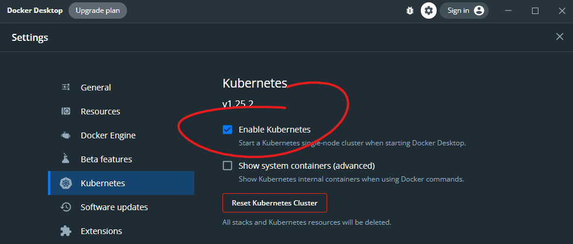

# Waypint 🍺

This is my speed guide for deploying a dotnet core application with Hashicorp waypoint.  

I'll be progressing from deploying to Docker Desktop for local development to:
 - Deploying staged releases in Kubernetes on Docker Desktop for a more flexible local development setup.
 - AWS ECS to simulate deploying to a shared QA environment.
 - Google Cloud Run to show the portability and simplicity afforded by using Waypoint rather than hand crafting Yaml.

# Intro
👋 I'm Shaun Lawrie from PartsTrader where I'm the Platform Engineering Lead.  

📈 [PartsTrader](https://www.partstrader.tech/) is a company that provides an online marketplace where repairers can efficiently provision parts for vehicle collision repairs.  

☁️ I'm currently using a mixture of tooling for AWS, Azure and on-prem tied together with:  
   GitHub Actions, Terraform, Puluma, Lambdas, Octopus Deploy...   

🐋 This demo will be a scary live demo using Docker Desktop/Kubernetes and Waypoint over an unreliable internet connection...   

# Steps

## Starting with Docker

### 1. Create a new mvc web application for dotnet core
```pwsh
dotnet new mvc --name "waypint"
```

### 2. Validate that our site does something
```pwsh
cd waypint
dotnet run
```

### 3. Install waypoint on docker
```pwsh
waypoint install --platform="docker" -accept-tos
```

### 4. Check out our shiny new deployment UI 
```pwsh
waypoint ui
```

### 5. Setup our project for use with waypoint
```pwsh
waypoint init
# say yes and follow the prompts choosing docker every time and no release option
# DO NOT CHOOSE LATEST AS THE TAG FOR YOUR APPLICATION WHILE DEVELOPING
```
https://github.com/hashicorp/waypoint/blob/main/builtin/k8s/platform.go#L345

### 6. Update the waypoint.hcl file:
To use the directory with our code, the big builder from paketo and local docker.
```pwsh
path = "./waypointer"
builder = "paketobuildpacks/builder:full"
local = true
```

### 7. Build and deploy our application
```pwsh
waypoint up
```

### 8. Check out the hostname service
We can choose our own test domain...
```pwsh
waypoint hostname register -app="waypint" waypint
```
https://waypint.waypoint.run/

## Blue Green Deployments with Kubernetes

### 1. Remove Waypoint from Docker
```pwsh
docker stop waypoints...
docker rm waypoints...
```

### 2. Enable Kubernetes in Docker Desktop and Install Waypoint into Kubernetes

```pwsh
waypoint install --platform=kubernetes -accept-tos
```

### 3. Update the Waypoint HCL for Kubernetes Deployment
```hcl
deploy {
  use "kubernetes" {
    probe_path = "/"
  }
}

release {
  use "kubernetes" {
    load_balancer = true
    port          = 3000
  }
}
```

### 4. Deploy the Site on Kubernetes
```pwsh
waypoint up
```

### 5. Deploy the Site on Kubernetes
Check out the new "prod site" at our load balancer address http://localhost:3000/

### 6. Edit the Website Homepage View
Edit the cshtml in `Views/Home/Index.cshtml` so there is a visible change in our next deployment.

### 7. Build the new version of the website
```pwsh
waypoint build
```

### 8. Build the new version of the website
```pwsh
waypoint deploy -release="false"
```
Notice that the preview URL shows the changes but the "prod site" at our load balancer address http://localhost:3000/ doesn't

### 9. Yolo no testing release it to prod
```pwsh
waypoint release
```
Now the change is live at http://localhost:3000/

### 10. Oh no that was catastrophic, let's rollback
```pwsh
waypoint release -deployment="ENTER_PREVIOUS_DEPLOYMENT_NUMBER"
```
Now the version at http://localhost:3000/ has been rolled back, note that because of network connection reuse you may need to close and reopen your browser to see this happen quicker.

🙏🐳

# Bonus
Try deploy to Google Cloud Platform
```pwsh
deploy {
  use "google-cloud-run" {
    project  = "your-gcp-project-name"
    location = "australia-southeast1"

    capacity {
      memory                     = 256
      cpu_count                  = 2
      max_requests_per_container = 10
      request_timeout            = 300
    }
  }
}

release {
  use "google-cloud-run" {}
}
```

### This was based on the documentation at:
https://developer.hashicorp.com/waypoint/tutorials/get-started-kubernetes/get-started-kubernetes.  

🪟🙏 I'm a bit of a Windows nerd and have something for vagrant over here to check out, thumb it up if you actually use hyper-v https://github.com/hashicorp/vagrant/issues/8384#issuecomment-1228509296
